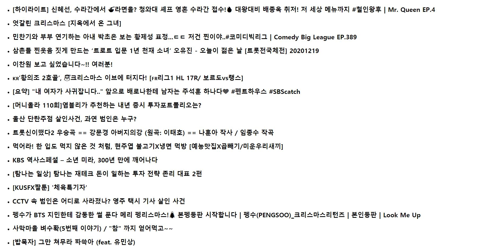

# YouTube Clone Coding

### 프로젝트 접근 방식

- 한 가지씩 기능을 추가해 나가는 방식
  1. youtube API 받아와서 국내 most popular 비디오 25개의 title 보여주기
     
  2. 비디오의 간략 정보 보여주기 (썸네일, 채널명, 등록일자 추가)
  3. search 창 만들기
  4. 비디오 선택했을 때, 정보가 자세하게 보이도록 설정 (description 추가)

### Method

1. mount 된 후, axios 를 활용하여 데이터 받아와서 **state(videos)**에 추가
   - fetch보다 구형 브라우저에서도 작동
   - JSON으로 자동 변환!
   - Node.js에서 사용 가능
   - csrf 보호 기능 탑재
