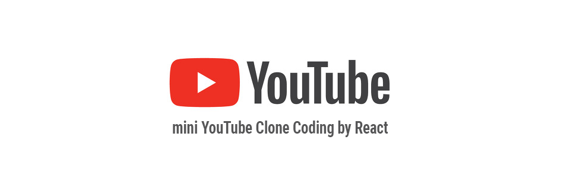

# YouTube Clone Coding

## 1. Introduction

Youtube API를 활용하여 메인페이지에는 국내에서 현재 가장 인기있는 영상 25개를 보여주고, 검색 창을 통해 영상을 검색할 수 있는 웹 어플리케이션이다. 

 

## 2. 사용 스킬

- ES2015+
- React
- Youtube API
 

## 3. Deployment

Github
 

## 4. 프로젝트 접근 방식   

기능을 한 가지씩 추가해 나가는 방식으로 진행한다.
 

## 5. 단계별 진행 방법    

#### 1. Youtube API를 이용하여, 국내에서 현재 가장 인기있는 비디오 25개의 title 보여주기     

- mount 된 후, Youtube API의 데이터는 axios를 활용하여 받아온 뒤, **state(videos)** 에 추가한다.    
   
>   < axios 사용 이유 > 
>   - fetch보다 구형 브라우저에서도 작동
>  - JSON으로 자동 변환!
>   - Node.js에서 사용 가능
>   - csrf 보호 기능 탑재
 

#### 2. 비디오의 간략 정보 보여주기 (썸네일, 채널명, 등록일자 추가)    

- video_list에 state(video)를 props로 전달해주고, 이를 활용하여 비디오 정보를 보여준다.    
 

#### 3. search 창 만들기    

- Ref를 활용하여 input DOM 엘리먼트를 저장하고, value 값을 검색쿼리로 전달하여 axios 통신한다.     
   => **state(videos)** 변경한다.    

- 검색 창은 createRef를 사용해서 리렌더링될 때마다 null 값으로 초기화시킨다.

> \+) 데이터 통신 리팩토링 - Dependency Injection
>
> - 한 가지의 기능을 담당하는 클래스(Youtube)로 분리한다.
> - 컴포넌트 외부에서 필요한 객체(youtube)를 생성한 후, 이를 props로 전달받아 사용한다.
>   => 장점 : 유닛테스트에 용이하다. / 재사용성, 가독성이 향상된다. / 유지보수에 용이하다.
 

#### 4. 비디오 선택하면 상세 정보 보여주기 

- video_item에 onClick 이벤트를 설정하여, 클릭된 비디오가 state(selectedVideo)가 되도록 함수를 추가한다.

- video_list를 mapping할 때, 선택된 비디오(selectedVideo)는 제외하고 변환될 수 있도록 null 값을 return한다.

- props로 display 방식을 전달해줘서 상황에 맞게 정렬 방식을 변경한다.    
  (선택된 비디오가 있는 경우: list 방식 / 없는 경우: grid 방식)

- 선택된 비디오가 있는 상태에서 검색하는 경우, state(selectedVideo)가 null이 되도록 재설정한다.
 

