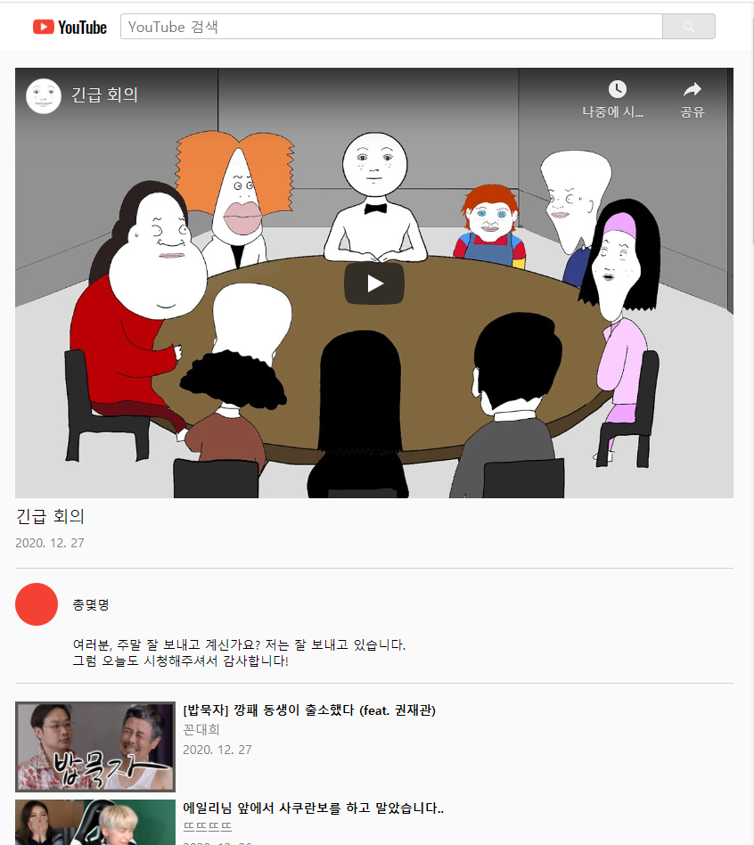

# YouTube Clone Coding

### 프로젝트 접근 방식

- 기능을 한 가지씩 추가해 나가는 방식으로 진행

> 1. Youtube API를 이용하여, 국내에서 현재 가장 인기있는 비디오 25개의 title 보여주기
>
>
> 
>
> 2. 비디오의 간략 정보 보여주기 (썸네일, 채널명, 등록일자 추가)
>
>
> 
>
> ---
>
> 3. search 창 만들기
>
>
> 
>
> ---
>
> 4. 비디오 선택했을 때, 정보가 자세하게 보이도록 설정 (description 추가)
>
>
> 
> 
> |전체 화면|반응형 화면|
> |---|---|
> |||
>
> ---

### Method

1. mount 된 후, axios 를 활용하여 데이터 받아와서 **state(videos)** 에 추가

   - fetch보다 구형 브라우저에서도 작동
   - JSON으로 자동 변환!
   - Node.js에서 사용 가능
   - csrf 보호 기능 탑재

2. video_list에 state(video)를 props로 전달해주고, 이를 활용하여 비디오 정보 보여주기

3. Ref를 활용하여 input DOM 엘리먼트를 저장하고, value 값을 검색 query로 전달하여 axios 통신 => **state(videos)** 변경

   - 검색 창은 리렌더링 될 때마다 null 값으로 초기화되어야 하므로, createRef 사용

> \+) 데이터 통신 리팩토링 - Dependency Injection
>
> - 한 가지의 기능을 담당하는 클래스(Youtube)로 분리
> - 컴포넌트 외부에서 필요한 객체(youtube)를 생성한 후, 이를 props로 전달받아 사용  
>   => 유닛테스트 용이 / 재사용성, 가독성 향상 / 유지 보수 용이

4. video_item에 onClick 이벤트를 설정하여, 클릭된 비디오가 state(selectedVideo)가 되도록 함수 추가

- video_list를 mapping할 때, selectedVideo는 제외하고 변환될 수 있도록 null 값 return

- props로 display 방식을 전달해줘서 상황에 맞게 정렬 변경    
  (selectedVideo가 있는 경우: list 방식 / 없는 경우: grid 방식)

- 선택된 비디오가 있는 상태에서 검색하는 경우, state(selectedVideo)가 null이 되도록 재설정 
